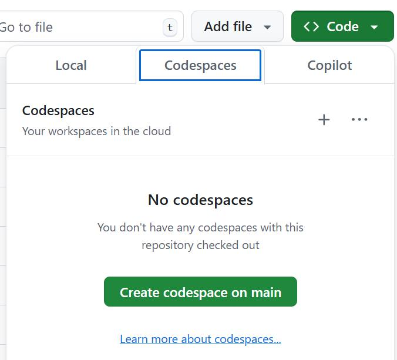

# Codepaces Setup
1) Click to the green `Code` button of the Github repo as shown below:

2) Click `Create codespace on main`.
3) Wait for container to boot.
4) Install the `Python` and `Jupyter` extensions under the `Recommended` tab of the `Extensions` tab on the left.
5) run `bash setup.sh`.
6) Don't forget to delete your codespace after use!

# Local Setup:
1) Clone/download the repo.
2) Ensure you have Python 3 on your machine (visit https://www.python.org/downloads/).
3) Ensure that python3-venv is installed (`sudo apt install python3-venv` if on WSL Ubuntu).
5) Install the `Python` and `Jupyter` extensions under the `Recommended` tab of the `Extensions` tab on the left.
4) run `bash setup.sh`.